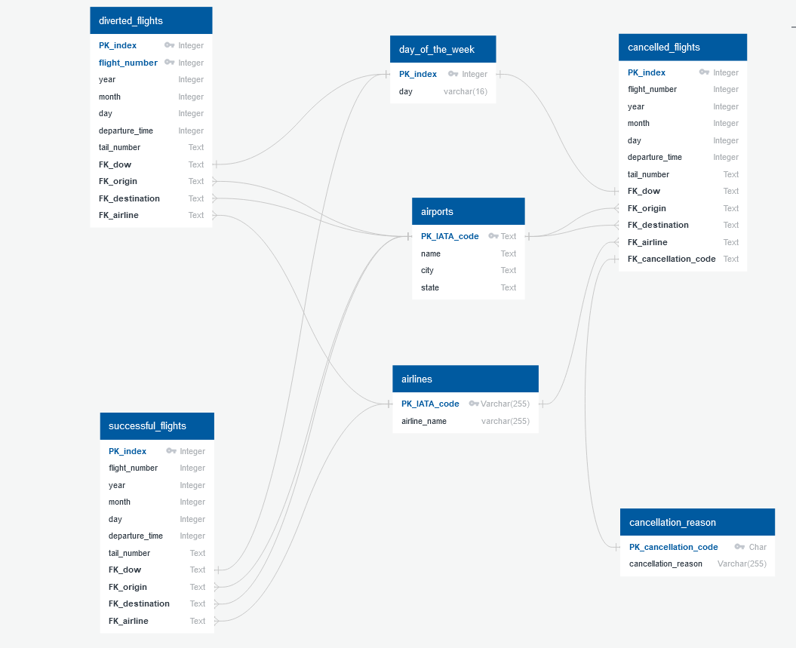
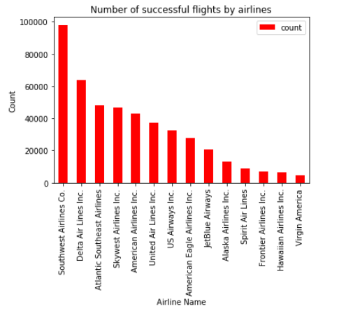
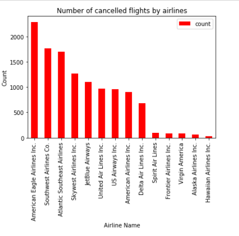
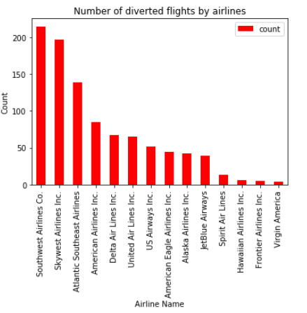
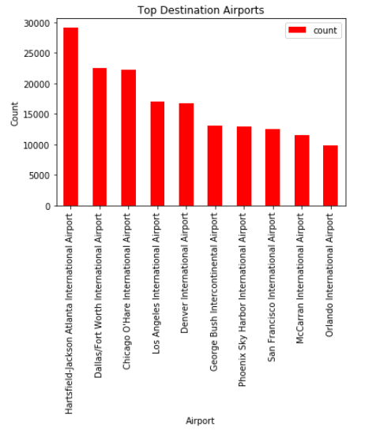
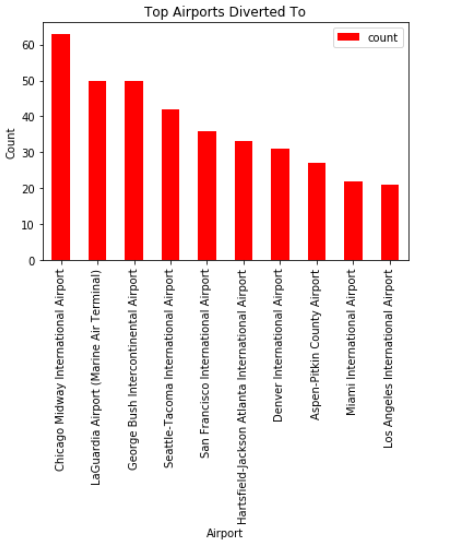
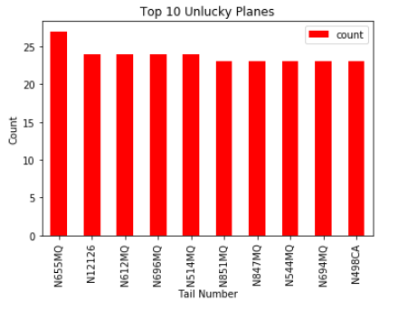

# ETLProject
Practice the ETL process using January 2015 Flight Data

Original Dataset for 2015 US Flight data from: https://www.kaggle.com/usdot/flight-delays

Check out my google slide at: https://docs.google.com/presentation/d/17cF4k4LwpudOIcYLG3Ctq5oPbAseXMcsJFmAI64hz7Y/edit?usp=sharing

### Created an ERD Diagram:

### Extract:

Downloaded CSV from kaggle
Create dataframes for airports, airlines, and flights
Separated January flight data for a smaller data set (For proof of concept)

### Transform:

Filtered the flight data into Cancelled, Diverted, and Successful Flights
Removed Null values
Create new tables for relational purposes
Filter out unnecessary columns
Restructured tables in preparation of loading into a database based on the ERD diagram

### Load

While using the ERD Diagram as a base, created a schema for tables
Connected the notebook to a local instance of Postgress using SQLAlchemy 
Used pandas to_sql function on the DataFrames to load them into the tables created

### Quick Analysis

(Remember this is data from January of 2015)

What airline has the most successful, cancelled, and diverted flights?

What's the most common airport to land and which one gets the most diverted flights?

Which planes gets cancelled the most?

